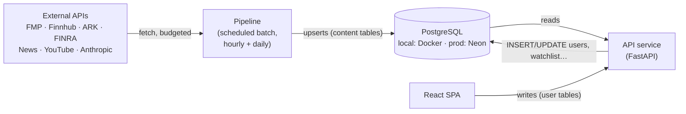

# Perennial Backend & Database — Operating Guide

**Maintainer:** @bryan (database/pipeline track) · **Last updated:** 2026-08-24
**Read this first** if you're touching anything under `development/backend/` or `development/database/`.

This is the rundown of how the database/backend side works, what exists today,
the order we're building the rest, and the rules that keep five people from
breaking each other's work. It links to the deeper docs instead of repeating
them:

| Doc | What it holds |
|---|---|
| [POSTGRES_SETUP.md](../database/POSTGRES_SETUP.md) | Database deep-dive, setup reasoning, session-by-session log of what was actually done |
| [pipeline-and-schema-guide.md](../../docs/architecture/pipeline-and-schema-guide.md) | **The source of truth for the schema DDL** and the pipeline's internal design (stages, idempotency, budgets, LLM gates) |
| [overview.md](../../docs/architecture/overview.md) / [data-flows.md](../../docs/architecture/data-flows.md) | System architecture, workflows, who-writes-what |
| [decisions/](../../docs/architecture/decisions/) | The 10 ADRs behind every non-obvious choice |

---

## 1. How the system works (one page)

Three moving parts share one PostgreSQL database. **The database is the
interface between them** — there is no queue, no cache, no second store
(ADR-003, ADR-007).



The one rule that everything else hangs off — **the writer invariant**:

> **The pipeline writes content tables. The API writes user tables. Neither
> ever crosses.** (Single sanctioned exception: `watchlist_items.has_new_event`
> — pipeline sets it, API clears it.)

Why: a user request can then never block on — or be corrupted by — a slow
third-party API or an LLM call; content is generated once per hour and served
thousands of times. If content is stale, the API serves it stale with a
`data_as_of` timestamp. It never fetches on demand.

Second load-bearing rule — **every pipeline write is an upsert on a natural
key** (`companies.ticker`, `events.content_hash`,
`raw_documents(provider, external_id)`, …). Running anything twice is a no-op.
That's what makes "the next hourly run is the retry" a safe failure policy.

### The schema in tiers

Nine tables exist today (migration 001); the rest are planned (002/003):

| Tier | Tables | Written by | Status |
|---|---|---|---|
| 0 reference | `sectors`, `companies` | pipeline | ✅ live |
| 2 operations | `pipeline_runs` | pipeline | ✅ live |
| 3 staging | `raw_documents`, `consensus_signals` | pipeline | ✅ live |
| 5 insight | `events`, `event_sector_impacts`, `event_company_impacts`, `event_sources` | pipeline | ✅ live |
| 4 market series | `company_price_snapshots`, `company_financials` | pipeline | migration 002 |
| 6 scoring | `confident_scores`, `sentiment_pulses`, `why_this_company` | pipeline | migration 002 |
| 1 users/auth | `users`, `refresh_tokens`, `user_interests`, `user_notification_preferences`, `watchlist_items` | **API only** | migration 003 → @hong |

Full DDL with column-level reasoning: guide §1.2. The shape worth memorizing:
`events → event_sector_impacts → event_company_impacts` is the two-level
fan-out that *is* the Event Impact Flow — the product's differentiator.

---

## 2. Environments

| | Local (yours) | Production |
|---|---|---|
| What | Docker `postgres:16-alpine`, port **5433** | Neon free tier, project `perennial`, PG 16.15, aws-us-east-1 |
| Who uses it | You alone — every dev runs their own | The deployed pipeline + migrations + (later) the API |
| Data | Seeds + whatever you generate | Real pipeline output |
| URL | in your `.env` (from `.env.example`, works as-is) | Neon console → Connect. Deploy env stores only. |

**There is no staging** (deliberate — overview §4). **There is no shared dev
DB** (deliberate — a shared mutable dev database is how one person's
experiment breaks four people's afternoon). If we ever need a scratch shared
instance, Neon branches give us one for free.

---

## 3. Teammate onboarding (15 minutes, self-serve)

```bash
git pull                                  # setup lives on bryan-working until merged
cd development
cp backend/.env.example backend/.env      # copy on Windows; local URL works unchanged
docker compose up -d db                   # or: make db-up   /   .\db.ps1 up
cd backend
python -m venv .venv && source .venv/bin/activate   # Windows: .venv\Scripts\activate
pip install -r requirements-db.txt
alembic upgrade head                      # your DB now matches prod's schema
python check_db.py                        # prints version/tables/revision — should match prod
```

No API keys are needed for database-only work. Keys go in your local `.env`
only when you work on a fetcher that needs them.

### The rules that keep it unbroken

1. **Never point your `.env` at production.** Local Docker is for
   development. Prod is written to by migrations and the deployed pipeline —
   nothing else. (This is the #1 way demo data dies the night before grading.)
2. **All schema changes go through Alembic migrations.** Never hand-`ALTER`
   any database, including your own local one — `db.ps1 reset` /
   `make db-reset` exists precisely so local state is always disposable.
3. **Merged migrations are immutable.** Wrong migration? Write a new one that
   fixes it. Editing history breaks everyone else's `alembic upgrade`.
4. **Don't run `alembic revision --autogenerate` yet.** Model classes don't
   exist for the created tables; with an empty model registry, autogenerate
   proposes dropping everything. Write migrations by hand until models catch
   up (tracked in §5 step 1).
5. **Secrets never enter git or Discord.** `.gitignore` covers `.env`; the
   Neon password lives in the console; if a credential ever leaks, say so
   immediately and rotate it — no blame, fast rotation.
6. **Pipeline code you write must be re-runnable.** Upsert on the natural
   key, never blind INSERT. The reviewer's first question is "what happens
   when this runs twice?"

---

## 4. Managing the database day-to-day

**Command crib sheet** (from `development/`; Windows: `.\db.ps1 <verb>`):

| Task | Command |
|---|---|
| Start / stop local PG | `make db-up` / `make db-down` |
| Apply migrations | `make db-upgrade` |
| Roll back one | `make db-downgrade` |
| What revision am I on? | `make db-current` (or `python check_db.py` for full detail) |
| SQL shell | `make db-psql` |
| Nuke + rebuild local | `make db-reset` (local only, by design) |

**Adding a migration** (the workflow, not just the command):

1. Write the migration by hand from the DDL in the guide (named constraints:
   `pk_`/`uq_`/`ck_`/`fk_` — future migrations must be able to drop things by
   name): `alembic revision -m "short description"`.
2. Test **both directions** locally: `alembic upgrade head`, `downgrade -1`,
   `upgrade head` again.
3. PR it. CI (`.github/workflows/db-ci.yml`) re-runs the full
   up→down→re-up cycle against a scratch PG 16 — a migration that can't roll
   back can't merge.
4. After merge, whoever deploys runs `upgrade head` against prod **as a
   release step** (§6). Local databases pick it up on next `git pull` +
   `db-upgrade`.

**Inspecting content:** `pipeline_runs` is the pipeline's flight recorder —
one row per run with per-stage counts/durations/errors in `stages` jsonb.
"Is the data fresh, and if not why" is a query, not log-spelunking:
`SELECT * FROM pipeline_runs ORDER BY started_at DESC LIMIT 5;`

---

## 5. Build plan — what's left, in order

Each step ends somewhere you could stop and demo. Detailed contracts for
every stage: guide Part 2. Current position: **everything above step 1 is
done** (local + prod schema live, CI gating migrations).

| # | Build | Ends when | Owner |
|---|---|---|---|
| 1 | SQLAlchemy models for the 9 live tables (mirror migration 001 exactly; then `alembic check` can join CI) | `check_db.py` extended to diff models vs DB; autogenerate becomes safe | @bryan |
| 2 | **First fetcher swap: `ark.py`** — replace its JSON-file save with a `consensus_signals` upsert (no API key needed, anyone can run it) | `python -m pipeline...` twice → real ARK rows, zero duplicates | @bryan + @hong |
| 3 | Pipeline skeleton: `RunContext`, stage registry, orchestrator, advisory lock, `pipeline_runs` writing (guide §2.1–2.3) | A run with zero stages logs a clean `pipeline_runs` row | @bryan |
| 4 | Remaining consensus fetchers (`fmp.py`, `insider.py`, `short_interest.py`) + `BudgetedClient` with the FMP 250/day math (guide §2.6) | Daily consensus data lands idempotently within budget | @hong |
| 5 | `news` stage + `raw_documents`; Cohen's YouTube pipeline re-homed (Firestore retired per ADR-003) | Headlines + transcripts in `raw_documents` | @bryan + @cohen |
| 6 | LLM stages: `events` + `impact_flow` with the hash gate and the **universe gate** (every ticker/sector the model names must exist in the DB, else dropped + counted) | An event with a real 2-level impact tree, `published=false` until validated | @bryan + @cohen |
| 7 | Migration 002 (tiers 4+6) + `market_data` + `scoring` stages | A company has a score with a breakdown | @bryan |
| 8 | FastAPI service: read endpoints over content tables (the 5 queries in guide §1.4) | Frontend gets real JSON from `/api/homepage`, `/api/events/:id` | @aalind + @jaden |
| 9 | Migration 003 (user tables) + auth (JWT/argon2 per ADR-006) | Signup/login/watchlist work | @hong |
| 10 | Seeds (idempotent, quality-gated) + `validate` stage (guide §2.11) + deploy compute + hourly cron | The app refills itself unattended | team |

**Blocked on team decisions** (neither blocks steps 1–6): the ADR-008 bucket
vote (Hao's `consensus.py` implements one definition, the ADR proposes
another — the `buckets` stage can't be written until this is settled) and the
NewsAPI-vs-GNews pick (ADR-009).

---

## 6. Production management

**Deploying schema changes:** `alembic upgrade head` with `DATABASE_URL`
pointed at Neon, run manually (or as a CI release step once compute exists) —
**never automatically on app startup**. A failed migration should block a
release, not crash a running service. Verify after every prod migration with
`check_db.py`.

**Backups — the actual DR plan** (Neon free tier keeps only ~6h of
point-in-time history, so this matters):

```bash
pg_dump "$PROD_DATABASE_URL" -Fc -f perennial_$(date +%Y%m%d).dump   # weekly
pg_restore --clean --if-exists -d "$LOCAL_DATABASE_URL" <file>.dump  # the drill
```

Weekly dump to a team-accessible location (Drive folder the team already
uses), and **do one restore drill before user testing** — a dump we've
restored once is a plan; one we've never restored is a hope. At our scale the
dump is megabytes and takes seconds.

**Monitoring (demo-scale honest):** no Grafana. Three checks cover it —
`pipeline_runs` (did the last run succeed, stage by stage), `check_db.py`
against prod (schema/revision sanity), and the data-quality `validate` stage
once built (guide §2.11) which blocks malformed impact trees from ever
getting `published=true`.

**Neon specifics:** compute autosuspends when idle → first query after a
quiet period takes ~1s extra (not an outage). 512 MB storage cap → the
90-day `raw_documents` retention and transcript truncation (guide §1.5) are
mandatory hygiene. Access for teammates: Neon console → org → People —
individual logins, no shared passwords.

**If prod data is ever wrong/corrupted:** don't hand-fix rows. Diagnose via
`pipeline_runs`, fix the stage bug, and let the idempotent re-run repair the
data (`--force` bypasses the hash gates when needed). Hand-edited prod data
and re-runnable pipelines are enemies.

**Credential hygiene:** the Neon password rotates from the console in one
click. Rotate on any suspected exposure and whenever someone leaves the
project. The prod URL lives in deploy env stores and nowhere else.

---

## 7. Team workflow

- **Branches → PR → `main`.** DB/backend work happens on personal branches
  (this doc lives on `bryan-working` until the team merges); `db-ci` gates
  every PR touching `development/backend/`.
- **Ownership** (from the team roster + this plan): @bryan
  database/pipeline · @hong auth/security + consensus fetchers · @cohen
  sentiment/LLM content · @aalind API architecture · @jaden
  frontend-facing API contracts.
- **Coordination points to bring to Monday meetings:** the ADR-008 vote,
  merging `hong-working`/`cohen-working` into the shared branch (their
  fetchers are the pipeline's inputs), Neon console invites, whose Drive
  folder holds backups, GitHub Student Pack claims before the compute
  platform choice.
- **When something DB-related breaks for you locally:** `db-reset` first
  (30 seconds, always safe locally). If it persists, it's real — post in
  Discord with the command + output, don't debug alone for an hour.

---

*Doc maintenance: update the status column in §1/§5 as steps land; log
significant setup actions in POSTGRES_SETUP.md's session log; propose rule
changes (§3) via PR so the change is reviewed like code.*
