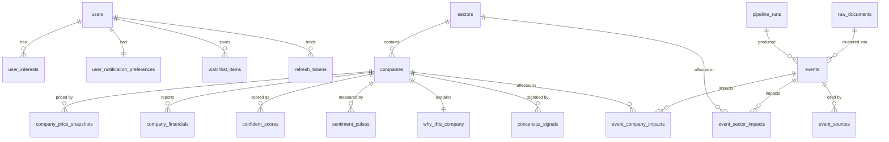
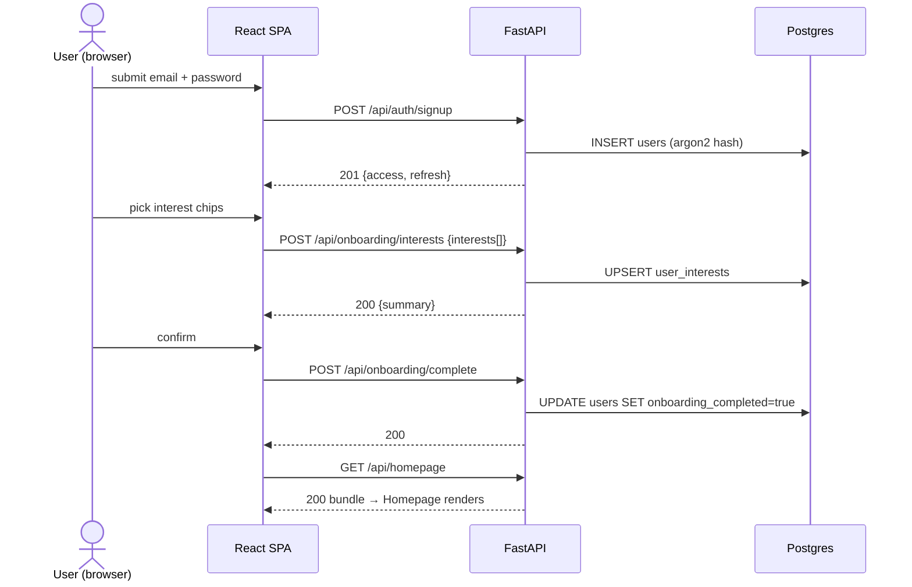
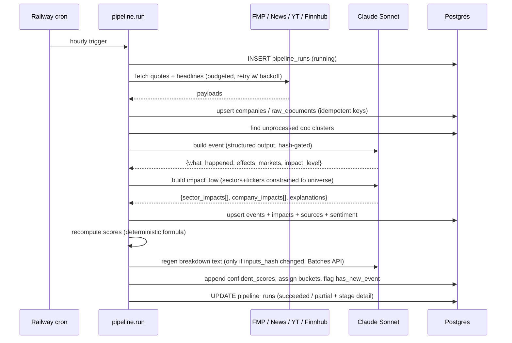
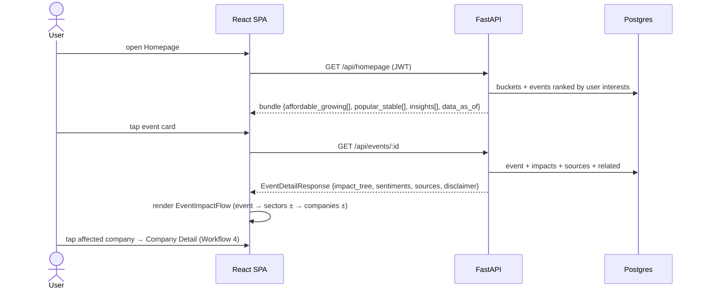
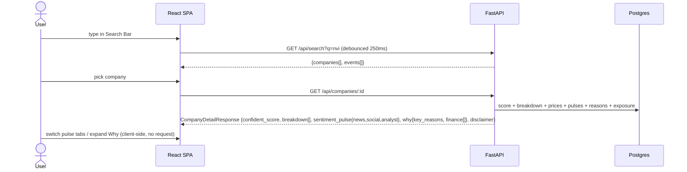
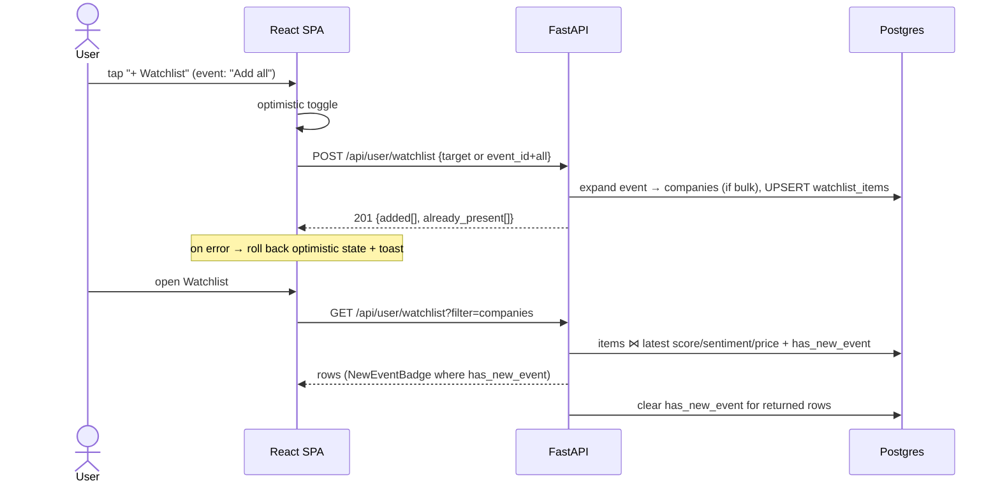

# Perennial — Data & Workflows

**Status:** Proposed (Phase 2 deliverable) · **Date:** 2026-08-03
**Companion:** [overview.md](overview.md) for components; [decisions/](decisions/) for the choices referenced here.

---

## 1. Core entities and first-pass schema

The entity list below starts from the repo's own draft (`development/database/schemas/TODO.md`, `development/backend/src/models/TODO.md`) and adds four tables the draft is missing but the working pipeline code requires: `raw_documents`, `consensus_signals`, `pipeline_runs`, `refresh_tokens`.

### Entity-relationship view



### First-pass schema (PostgreSQL)

Conventions adopted from `schemas/TODO.md` verbatim: uuid PKs, snake_case, `created_at`/`updated_at` everywhere, `jsonb` not `json`, indexes on FKs and WHERE columns.

```sql
-- ============ users & auth (written by API only) ============
users (
  id uuid PK, email citext UNIQUE NOT NULL, password_hash text NOT NULL,
  name text, investment_summary text,
  onboarding_completed bool DEFAULT false,
  deleted_at timestamptz,              -- soft-delete: 30-day grace (see §4)
  created_at, updated_at
)
refresh_tokens (
  id uuid PK, user_id FK->users ON DELETE CASCADE,
  token_hash text NOT NULL, expires_at timestamptz NOT NULL,
  revoked_at timestamptz, created_at
)
user_interests (
  id uuid PK, user_id FK->users ON DELETE CASCADE,
  interest_type text CHECK (interest_type IN ('sector','theme')),
  interest_value text NOT NULL,
  UNIQUE (user_id, interest_type, interest_value)   -- idempotent onboarding saves
)
user_notification_preferences (          -- seam only in v1; no delivery channel yet
  user_id PK FK->users ON DELETE CASCADE,
  channels jsonb DEFAULT '{}', frequency text, types_enabled jsonb DEFAULT '{}'
)
watchlist_items (
  id uuid PK, user_id FK->users ON DELETE CASCADE,
  target_type text CHECK (target_type IN ('company','sector')),
  target_id uuid NOT NULL,
  has_new_event bool DEFAULT false,      -- written by pipeline stage 9
  added_at timestamptz,
  UNIQUE (user_id, target_type, target_id)   -- makes add idempotent (Workflow 5)
)

-- ============ market reference (written by pipeline) ============
sectors ( id uuid PK, name text UNIQUE, display_label text )
companies (
  id uuid PK, ticker text UNIQUE NOT NULL, name text NOT NULL,
  sector_id FK->sectors, market_cap numeric, current_price numeric,
  traffic_light text CHECK (traffic_light IN ('green','yellow','red')),
  momentum text CHECK (momentum IN ('up','down','flat')),
  bucket text CHECK (bucket IN ('affordable_growing','popular_stable',NULL)),  -- ADR-008
  is_active bool DEFAULT true,           -- universe membership (50–150 tickers, Q7)
  last_updated timestamptz
)
company_price_snapshots (
  id uuid PK, company_id FK, captured_at timestamptz,
  price numeric, week_52_low numeric, week_52_high numeric, week_52_avg numeric,
  fair_value_low numeric, fair_value_high numeric,
  UNIQUE (company_id, captured_at::date)          -- one snapshot/day is enough for the WeekRangeBar
)
company_financials (
  id uuid PK, company_id FK, year int, revenue numeric,
  UNIQUE (company_id, year)                        -- 5-yr RevenueChart
)

-- ============ ingestion staging (written by pipeline) ============
raw_documents (                -- unified staging for news articles + YT transcripts + analyst notes
  id uuid PK,
  source_type text CHECK (source_type IN ('news','social_media','analyst')),
  external_id text NOT NULL,   -- URL hash / video id / provider id
  title text, body text, url text, author text, published_at timestamptz,
  payload jsonb,               -- provider-specific extras (view counts, tags…)
  fetched_at timestamptz, processed_at timestamptz,
  UNIQUE (source_type, external_id)                -- refetch-safe (idempotent)
)
consensus_signals (            -- congress trades, ARK holdings, insider buys (hong-working fetchers)
  id uuid PK, company_id FK NULL, ticker text NOT NULL,
  signal_type text CHECK (signal_type IN ('congress_trade','ark_holding','insider_buy')),
  payload jsonb NOT NULL,      -- the parsed dicts fmp.py/ark.py/insider.py already produce
  observed_at date, fetched_at timestamptz,
  UNIQUE (signal_type, ticker, observed_at, (payload->>'dedupe_key'))
)

-- ============ insight content (written by pipeline; LLM-derived fields marked ✦) ============
events (
  id uuid PK, headline text NOT NULL, slug text UNIQUE,
  summary text, what_happened text ✦, effects_markets_summary text ✦,
  impact_level text CHECK (impact_level IN ('high','medium','low')),
  source_name text, source_url text, published_at timestamptz,
  content_hash text,           -- hash of clustered inputs → skip unchanged LLM regen (ADR-005)
  pipeline_run_id FK->pipeline_runs, created_at, updated_at
)
event_sector_impacts (
  id uuid PK, event_id FK ON DELETE CASCADE, sector_id FK,
  impact_type text CHECK (impact_type IN ('positive','negative','neutral')),
  explanation text ✦,          -- the per-node string EventImpactFlow renders
  UNIQUE (event_id, sector_id)
)
event_company_impacts (
  id uuid PK, event_id FK ON DELETE CASCADE, company_id FK,
  via_sector_id FK->sectors,   -- which branch of the flow tree this hangs off
  impact_type text, explanation text ✦,
  UNIQUE (event_id, company_id)
)
event_sources (
  id uuid PK, event_id FK ON DELETE CASCADE,
  source_type text CHECK (source_type IN ('news','social_media','analyst')),
  excerpt text, url text, sentiment text CHECK (sentiment IN ('positive','mixed','negative')),
  raw_document_id FK->raw_documents NULL
)

-- ============ scoring & sentiment (written by pipeline) ============
confident_scores (             -- append-only snapshots; latest-per-company view serves reads
  id uuid PK, company_id FK, score int CHECK (score BETWEEN 0 AND 100),
  breakdown jsonb ✦,           -- [{factor, weight, contribution, explanation}]
  event_exposure_summary text ✦, analyst_outlook_summary text ✦,
  inputs_hash text,            -- regenerate LLM text only when this changes (ADR-005)
  captured_at timestamptz
)
sentiment_pulses (
  id uuid PK, company_id FK,
  source_type text CHECK (source_type IN ('news','social_media','analyst')),
  positive_pct int, mixed_pct int, negative_pct int,
  top_excerpts jsonb,          -- [{excerpt, url, sentiment}]
  captured_at timestamptz,
  UNIQUE (company_id, source_type, captured_at::date)
)
why_this_company (
  company_id PK FK, key_reasons jsonb ✦,   -- [{reason, explanation}]
  last_updated timestamptz
)

-- ============ operations ============
pipeline_runs (
  id uuid PK, trigger text CHECK (trigger IN ('cron','manual')),
  started_at, finished_at,
  status text CHECK (status IN ('running','succeeded','partial','failed')),
  stages jsonb    -- {stage_name: {status, rows_written, duration_ms, error}}
)
```

**Deltas vs the repo draft, and why**
- `raw_documents`, `consensus_signals`: the working code on `cohen-working`/`hong-working` writes JSON files/Firestore today; these tables are their Postgres landing zone (both files literally say "migrate to a SQL database" / "Replace with write_to_db()").
- `refresh_tokens`: required by the `POST /api/auth/refresh` + revocation flow in `backend/TODO.md`; absent from the draft.
- `pipeline_runs`: the observability + idempotency ledger (overview.md §5).
- `companies.bucket` + `is_active`: bucket membership must be stored, not computed per request, so the *explanation* for membership can be stored with it (ADR-008); `is_active` bounds the universe (Q7).
- `events.content_hash`, `confident_scores.inputs_hash`: the cost-control mechanism for LLM regeneration (ADR-005).
- Dropped nothing from the draft. `ExperienceLevel`/Risk-Comfort fields stay **out** per ASSUMPTION A2 (`shared/types/TODO.md` already lists the enum as "pending decision" — reversing costs one migration on `user_interests`).

---

## 2. Where state lives, who writes it, cached vs authoritative

| State | Authoritative home | Sole writer | Readers | Cached where (never authoritative) |
|---|---|---|---|---|
| Accounts, password hashes, refresh tokens | Postgres `users`/`refresh_tokens` | API | API | — |
| Interests, notification prefs | Postgres | API | API, pipeline (personalization ranking) | React Query (per-session) |
| Watchlist membership | Postgres `watchlist_items` | API | API | React Query, optimistic updates |
| `watchlist_items.has_new_event` | Postgres | **Pipeline** (set) + API (clear on view) | API | — |
| Ticker universe, sectors, prices, fundamentals | Postgres | Pipeline | API | React Query (5-min staleTime) |
| Events, impact flows, sources | Postgres | Pipeline | API | React Query |
| Scores, sentiment, key reasons | Postgres | Pipeline | API | React Query |
| Raw docs, consensus signals | Postgres | Pipeline | Pipeline only | — |
| JWT access token | — (stateless, 15-min TTL) | API signs | API verifies | Browser memory (not localStorage; refresh token in httpOnly cookie) |
| Pipeline run status | Postgres `pipeline_runs` | Pipeline | API (`data_as_of`), operator | — |

Two invariants fall out of this table and are worth enforcing in code review:

1. **The API never writes content tables; the pipeline never writes user tables** (single exception: `has_new_event`, which is content-derived per-user state — pipeline sets, API clears).
2. **Every cache is a React Query cache with a TTL.** There is no server-side cache in v1 (ADR-007) — Postgres over ~150 tickers is the cache.

---

## 3. Main workflows

Every workflow lists: the hop-by-hop trace, a sequence diagram, and **failure/retry/idempotency/user-visible behavior**.

### Workflow 1 — Signup & onboarding (Get Started → Choose Interest → Confirmation → Homepage)

Per `design/user-flows/TODO.md` Flow 1, plus the auth screens `frontend/src/pages/TODO.md` adds ("Auth (not in IA but required)").

**Trace:** Browser `Signup` page → `POST /api/auth/signup` (router `auth` → `AuthService.signup`: validate, argon2-hash, INSERT `users`, issue access+refresh) → browser stores tokens → `ChooseInterest` page → `POST /api/onboarding/interests` (`OnboardingService`: bulk upsert `user_interests`, return summary for `Confirmation`) → user confirms → `POST /api/onboarding/complete` (set `users.onboarding_completed = true`) → redirect Homepage → `GET /api/homepage`.



**Failure midway:** duplicate email → 409 with field-level message, form keeps input. If the user closes the tab after signup but before completing onboarding, `onboarding_completed=false` routes them back to `ChooseInterest` on next login — onboarding is resumable by construction.
**Retries:** none automatic on mutations; the user resubmits. Safe because:
**Idempotent:** interests upsert on `UNIQUE (user_id, type, value)`; `complete` sets a flag (naturally idempotent); double-submit of signup hits the email unique constraint.
**User sees on failure:** inline validation errors (400/409); generic retry toast on 5xx. Never a blank screen.

---

### Workflow 2 — Hourly ingestion pipeline (system workflow)

The content factory (overview.md §2.3, stages 1–9). Cadence: hourly for news/events/scores; heavy fetchers daily (ADR-004; matches the "daily 9am" comments in `origin/hong-working` fetchers while honoring Q5's hourly answer for the user-visible layer).

**Trace:** Railway cron → `pipeline.run` → INSERT `pipeline_runs(running)` → stage 1 market-data (FMP quotes for `is_active` tickers, upsert `companies`, `company_price_snapshots`) → stage 3 news (fetch, hash, upsert `raw_documents`) → stage 5 event-build: cluster new docs; per cluster compute `content_hash`; **skip if an event with that hash exists**; else one Claude Sonnet call (structured output) → upsert `events` → stage 6 impact-flow: per new/changed event, one Claude Sonnet call constrained to the known sector list + ticker universe → upsert `event_*_impacts` → stage 7 sentiment (classify new docs per company/source; upsert `sentiment_pulses` + `event_sources`) → stage 8 score: recompute deterministic score per company; if `inputs_hash` changed, queue Breakdown/KeyReasons text regeneration via the **Message Batches API**; append `confident_scores` → stage 9 buckets + set `has_new_event` for watchlists whose targets gained impacts this run → UPDATE `pipeline_runs(succeeded|partial)`.



**Failure midway:** each stage runs in its own try/except; a stage failure records `{stage: failed, error}` and the run continues with stages that don't depend on it (news failing doesn't stop market-data; impact-flow failing leaves events without flows this hour — the previous flow keeps serving). Run status becomes `partial`.
**Retried:** external calls retry in-run with exponential backoff (tenacity, 3 attempts, honoring 429 `retry-after` — Cohen's yt-dlp code already implements this pattern and keeps it). Failed stages are *not* retried mid-hour; the next hourly run is the retry.
**Idempotent by construction:** every write is an upsert on a natural key (`raw_documents(source_type,external_id)`, `events(content_hash)`, `sentiment_pulses(company,source,day)`, snapshot-per-day keys). Running the pipeline twice in a row is a no-op — this is the property that makes "the next run is the retry" safe, and it satisfies the seeds convention ("Idempotent — running twice doesn't duplicate", `database/seeds/TODO.md`).
**Concurrency guard:** `pipeline_runs` row with `status='running'` younger than 55 min → new run exits immediately (prevents overlap if a run drags).
**User sees during failure:** nothing breaks. Screens serve last-good content; the homepage shows `data_as_of` from the last successful stage. Staleness > 3 hours can surface a quiet banner ("insights may be delayed") — worth adding, cheap.
**LLM output validation:** every Claude response is parsed against a Pydantic schema (`client.messages.parse`); any ticker/sector not in the known universe is dropped and logged. A schema-invalid response after 2 attempts fails just that item, not the stage.

---

### Workflow 3 — Discover an investment via an event (the differentiator; Use Case 1)

`design/user-flows/TODO.md` Flow 2: Homepage → Insight → Event Detail (Impact Flow) → Affected Company → Company Detail → + Watchlist.

**Trace:** Homepage mounts → `GET /api/homepage` (router `homepage` → `HomepageService.compose`: one query batch — bucket lists ordered per ADR-008, top events ranked by recency × `impact_level` × overlap with `user_interests` [personalization per `services/TODO.md`]) → user taps an `EventCard` → `GET /api/events/:id` (`EventService.detail`: event + sector impacts + company impacts + sources + related events [same sectors, recent] in one payload — the `EventDetailResponse` of `shared/types/TODO.md`) → frontend renders `EventImpactFlow` from the nested `impact_tree` JSON (pure presentation; tree already shaped server-side) → user taps an `AffectedCompanyRow` → Workflow 4 → user taps `+ Watchlist` → Workflow 5.



**Failure midway:** homepage bundle 5xx → full-page `ErrorState` with retry. Event 404 (pruned by retention) → "This insight has expired" + back to Homepage. Impact tree empty (LLM stage failed for this event) → Event Detail still renders What Happened/sources; the flow section shows its empty state — **degrade by section, never blank the screen**.
**Retries:** React Query default (2 retries, backoff) on GETs — safe, reads are idempotent.
**Idempotent:** all reads.
**User sees during failure:** skeletons while loading; per-section empty states; retry affordances.

---

### Workflow 4 — Research a company (Use Case 2)

Flow 3: Search Bar or list row → Company Detail → Sentiment Pulse tabs → Why This Company → + Watchlist.

**Trace:** `HomepageSearchBar` keystrokes → debounced (`useDebounce`) `GET /api/search?q=` (ILIKE/trigram over `companies.ticker/name` + `events.headline` — 150 tickers needs nothing fancier) → navigate → `GET /api/companies/:id` (`CompanyService.detail` composes the full bundle from latest `confident_scores`, `company_price_snapshots`, `sentiment_pulses` (3 rows), `why_this_company`, `event_company_impacts` recent → the `CompanyDetailResponse` bundle of `backend/TODO.md`) → tab switches and "Why This Company" expansion are **client-side** over the already-delivered bundle (one round-trip per screen; `GET /api/companies/:id/sentiment-pulse` and `/why` remain for deep-links/refresh) → `RevenueChart` renders `company_financials` 5-yr rows.



**Failure midway:** search request fails → dropdown shows "search unavailable", typing keeps working; stale-score company (pipeline behind) → serve latest snapshot with its `captured_at` visible in the Breakdown ("as of …"). Missing sub-sections (e.g., no analyst pulse yet) render that tab's empty state.
**Retries:** React Query on reads; abandoned debounced searches are cancelled (AbortController) — last-writer-wins, no stale dropdowns.
**Idempotent:** all reads.
**User sees during failure:** per-section placeholders; the Confidence Score never renders without its Breakdown attached (explainability invariant from `services/TODO.md` — "must include the explanation string, not just the number").

---

### Workflow 5 — Watchlist add / remove / bulk-add

Flow 4 plus the event-screen "Add all" bulk action (`backend/TODO.md`: watchlist POST "supports adding single company OR a sector OR an event's 'Add all'").

**Trace (add):** tap `+ Watchlist` → optimistic UI flip → `POST /api/user/watchlist {target_type, target_id}` (or `{event_id, all: true}` → server expands to that event's affected companies) → `WatchlistService.add`: upsert on the unique key → 201 (or 200 if it already existed) → React Query invalidates `watchlist` queries. **Remove:** `DELETE /api/user/watchlist/:id` → 204 (idempotent: deleting a gone row still 204s). **List:** `GET /api/user/watchlist?filter=all|companies|sectors` joins latest score + sentiment + `has_new_event` per row; viewing the list clears `has_new_event` for displayed rows.



**Failure midway:** mutation fails → optimistic state rolls back, toast with retry. Bulk-add partially known tickers → response separates `added` vs `already_present`; nothing errors.
**Retried:** user-initiated retry only; safe to mash the button:
**Idempotent:** upsert on `UNIQUE (user_id, target_type, target_id)`; DELETE tolerant of absence.
**User sees during failure:** the row visibly reverts — the UI never silently lies about what is saved.

---

### Workflow 6 — Settings, change password, data export & deletion (privacy)

Flow 5 plus the CCPA/GDPR endpoints `backend/TODO.md` requires "even though no dedicated screen".

**Trace (change password):** Setting → Change Your Password → `POST /api/auth/change-password {current, new}` → verify current (argon2) → update hash → **revoke all refresh tokens except the current session's** → 200.
**Trace (export):** `GET /api/user/data` → JSON dump of the user's rows (profile, interests, prefs, watchlist) → browser download.
**Trace (delete):** `DELETE /api/user/data` → set `users.deleted_at = now()` (soft) → revoke all refresh tokens → 200 with grace-period notice → daily retention job hard-deletes rows where `deleted_at < now() - 30 days` (CASCADE wipes interests/prefs/watchlist/tokens). Logging back in within 30 days clears `deleted_at` (undo).

**Failure midway:** wrong current password → 403, form error, no state change. Hard-delete job failure → rows persist one extra day (job is idempotent; next run sweeps).
**Idempotent:** soft-delete timestamp set-if-null; hard-delete sweep re-runnable; export is a read.
**User sees:** immediate confirmation of deletion + "30 days to change your mind" copy; export downloads instantly (rows are tiny at this scale).

---

## 4. Data lifecycle

### Validation points

| Boundary | Mechanism |
|---|---|
| Browser → API | Pydantic request models on every route (the `validation` middleware of `middleware/TODO.md`); password strength + email checks mirrored client-side (`frontend/src/utils/TODO.md` validators) |
| External API → pipeline | Per-provider response schemas; unparseable records are skipped + counted in `pipeline_runs.stages`, never crash a stage (Hao's parsers already behave this way — keep it) |
| LLM → pipeline | Structured outputs parsed against Pydantic schemas; **referential check: every ticker/sector the model names must exist in the universe**, else the item is dropped and logged (anti-hallucination gate, ADR-005) |
| Pipeline → DB | CHECK constraints + unique keys above are the last line of defense |

### Transformations (provenance chain)

`raw_documents` → (cluster + LLM) → `events` → (LLM, constrained) → `event_*_impacts` → (classifier) → `sentiment_pulses`/`event_sources` → (formula + LLM text) → `confident_scores`/`why_this_company` → (criteria) → `companies.bucket`. Every derived row is traceable back: impacts→event→run (`pipeline_run_id`), excerpts→`raw_document_id`. When a user asks "why?", the answer chain exists in the schema — this is the product's core promise made structural.

### Retention & deletion

| Data | Retention | Mechanism (daily job) |
|---|---|---|
| `raw_documents` | 90 days | delete by `fetched_at`; `event_sources.raw_document_id` goes NULL (excerpt text is copied, so UI unaffected) |
| `events` + impacts | 180 days (Related Events stays useful) | delete cascade |
| `confident_scores` snapshots | latest 30 per company | windowed delete |
| `sentiment_pulses` | 90 days | delete by `captured_at` |
| `pipeline_runs` | 90 days | delete |
| `refresh_tokens` | expired + 7 days | delete |
| Soft-deleted users | 30-day grace → hard delete CASCADE | Workflow 6 |
| Server logs | 30 days (platform default) | Railway retention |

### Where PII crosses a boundary

PII held: **email, name, password hash, interests, watchlist** — nothing else (no financial account data; Perennial doesn't execute trades, `README.md`).

| Boundary | PII crossing? |
|---|---|
| Browser ↔ API | Yes (TLS; JWT carries only `sub`+`exp`, never email/name) |
| API/pipeline → Anthropic | **Never.** Prompts contain public market/news/transcript text only (ADR-005). |
| API/pipeline → FMP/Finnhub/News/YouTube | **Never.** Requests are keyed by ticker/query, not by user. |
| DB → backups | Yes (Railway managed backups; access limited to deploy owners) |
| Research-participant data (M2/M5 user testing) | **Stays out of this system entirely** — consent forms/transcripts live in Drive with participant IDs per `docs/research/TODO.md`; the app database never stores tester PII beyond their own test accounts. |

Third-party data handling note: transcripts and headlines we store are third-party content, retained ≤90 days and used only for classification/excerpting — consistent with the citation-with-URL pattern (`event_sources.url`) rather than republishing full texts.
