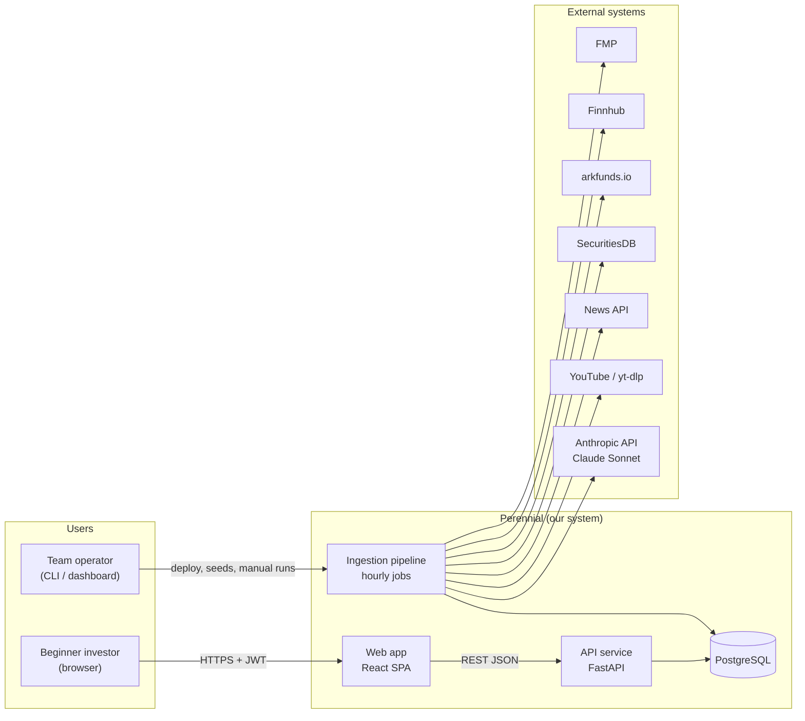
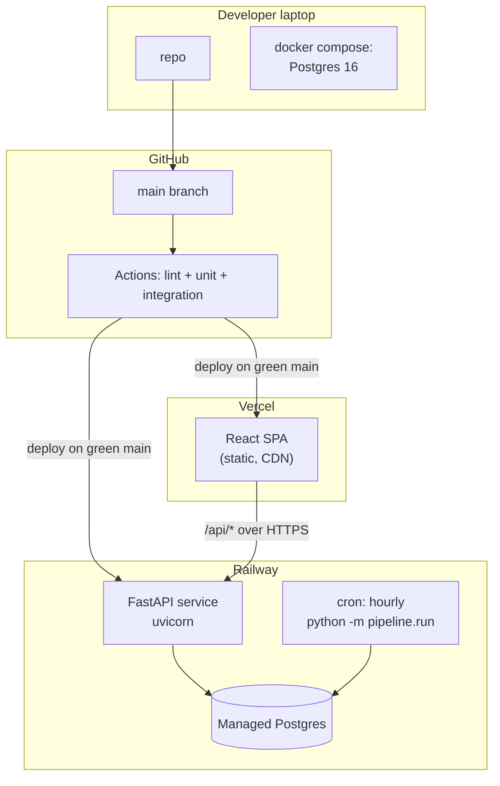

# Perennial — Architecture Overview

**Status:** Proposed (Phase 1 deliverable) · **Date:** 2026-08-03
**Inputs:** Phase 0 repo interrogation + team answers (Bryan, 2026-08-03).
**Companion docs:** [data-flows.md](data-flows.md) · [stack-decision.md](stack-decision.md) · [build-plan.md](build-plan.md) · [decisions/](decisions/)

---

## Locked decisions this architecture is built on

| # | Decision | Source | ADR |
|---|----------|--------|-----|
| 1 | **Web app** (mobile-first responsive React), not React Native | Team answer Q1 | [ADR-001](decisions/ADR-001-web-app-not-react-native.md) |
| 2 | **Python backend** (absorbs existing pipeline code on `cohen-working` / `hong-working` branches) | Team answer Q2 | [ADR-002](decisions/ADR-002-python-fastapi-modular-monolith.md) |
| 3 | **PostgreSQL** as the single authoritative store; Firestore retired | Team answer Q3; `development/database/TODO.md` ("PostgreSQL confirmed") | [ADR-003](decisions/ADR-003-postgres-single-store.md) |
| 4 | **Demo scale** — graders, team, 5–8 user testers; <100 accounts | Team answer Q4 | — |
| 5 | **Hourly** data/score refresh cadence | Team answer Q5 | [ADR-004](decisions/ADR-004-hourly-batch-pipeline.md) |
| 6 | **Claude Sonnet** LLM, ingestion-time only | Team answer Q6 | [ADR-005](decisions/ADR-005-claude-sonnet-ingest-only.md) |
| 7 | **50–150 ticker** curated universe | Team answer Q7 | [ADR-009](decisions/ADR-009-data-source-selection.md) |
| 8 | ~5-month runway; plan by milestone, not by date | Team answer Q8 | — |

**Assumptions carried forward (not explicitly confirmed — flag at next team meeting):**

- **ASSUMPTION A1:** The P0/P1/P2 MVP cut proposed in root `TODO.md` ("Suggested MVP subset for M5") is accepted as-is.
- **ASSUMPTION A2:** **Risk Comfort onboarding is OUT.** The IA (`design/information-architecture/TODO.md`) is the locked source of truth and does not contain it; the M4 doc mention is treated as historical. The schema keeps a seam for it (see data-flows.md → lifecycle) so reversing this costs one migration, not a redesign.
- **OPEN TEAM VOTE:** What "Affordable & Growing" / "Popular & Stable" *mean* is currently contradictory between `development/backend/src/services/TODO.md` (screening criteria) and the working pipeline on `origin/hong-working` (ARK holdings / Congress+insider consensus). [ADR-008](decisions/ADR-008-bucket-semantics.md) proposes a resolution but needs a team vote.

---

## 1. System context

### Users

| Actor | Description | Trust level |
|-------|-------------|-------------|
| **Beginner investor** | Alex / Maria / David personas (`README.md` → "Who it's for"). Authenticated via email+password. Reads insights, manages watchlist and preferences. | Untrusted input; authenticated |
| **Team operator** | A team member running seeds, triggering a manual pipeline run, inspecting logs. No in-app admin UI in v1 — operates via CLI/DB. | Trusted; holds deploy + DB credentials |

### External systems

All third-party access happens **server-side, from the pipeline only** — the browser and the request path never touch these (see §3).

| System | Purpose | Auth | Notes |
|--------|---------|------|-------|
| Financial Modeling Prep (FMP) | Quotes, market cap, 5-yr revenue, 52-wk range; Congress trades | API key | Free tier **250 req/day** (`origin/hong-working:.../fmp.py` header) — the binding constraint on cadence |
| Finnhub | Analyst recommendation trends + price targets → "Analyst" sentiment tab & Analyst Outlook | API key | Key already provisioned in `.env.example` on `hong-working` |
| arkfunds.io | ARK ETF holdings (consensus signal) | none | Working fetcher exists (`ark.py`) |
| SecuritiesDB | SEC Form 4 insider buys (consensus signal) | none | Working fetcher exists (`insider.py`) |
| Senate Stock Watcher (GitHub raw) | Congress trade history backfill | none | Working fetcher exists (`fmp.py`) |
| News API (NewsAPI or GNews — pick one, ADR-009) | Headlines/articles → events | API key | Free tiers ~100 req/day (verify current terms before locking) |
| YouTube Data API + yt-dlp | Social sentiment source (transcripts) | API key | Working pipeline exists on `cohen-working`. yt-dlp scraping is a **ToS gray area — accepted-risk item**, see build-plan.md risks |
| Anthropic API (Claude Sonnet, `claude-sonnet-5`) | Event summaries, Event Impact Flow decomposition, score breakdowns, key reasons | API key | Ingestion-time only, never in the request path (ADR-005) |

### Trust boundaries

1. **Browser ↔ API** — untrusted client. JWT bearer auth on `/api/user/*`, `/api/onboarding/*`; Pydantic validation on every input; rate limiting per `development/backend/src/middleware/TODO.md`.
2. **API/pipeline ↔ external APIs** — keys live only in server env vars (near-miss already happened: commit *"updating gitignore against credentials"* on `cohen-working`). Responses from third parties are treated as untrusted data and schema-validated on ingest.
3. **Pipeline ↔ Anthropic** — only public market/news/transcript text crosses this boundary. **No user PII is ever sent to the LLM** (ADR-005).

---

## 2. Component breakdown

One repo, one Python backend codebase, **two runtime processes** (API server + scheduled pipeline) sharing models and DB — a modular monolith (ADR-002). At demo scale, splitting further is pure overhead.

### 2.1 Web app (React SPA)

| | |
|---|---|
| **Responsibility** | Render the 9 IA screens (`design/information-architecture/TODO.md`); own all presentation state |
| **Owns** | Routing, component library (`development/frontend/src/components/TODO.md`), React Query cache, form state, JWT storage |
| **Does NOT own** | Any business logic: scores, bucket membership, impact flows, sentiment math all arrive pre-computed as JSON. The frontend never calls a third-party API. |

### 2.2 API service (FastAPI)

| | |
|---|---|
| **Responsibility** | Serve the IA-aligned REST endpoints listed in `development/backend/TODO.md`; own authn/z and user-owned state |
| **Owns** | Request validation, JWT issue/verify, all **writes to user tables** (users, interests, prefs, watchlist), read-composition of content tables (homepage bundle, event detail, company detail) |
| **Does NOT own** | Content generation. It never calls the LLM, never calls a market/news API, never mutates content tables. If data is stale, it serves stale data with a `data_as_of` timestamp — it does not fetch on demand. |

Internal layering per the repo's own conventions (`backend/src/api/TODO.md`: "handlers are THIN"):
`routers/` (validate → call service → shape response) → `services/` (business logic, framework-agnostic) → `models/` (SQLAlchemy) → `clients/` (external APIs, used by pipeline only).

### 2.3 Ingestion pipeline (same codebase, separate entrypoint)

| | |
|---|---|
| **Responsibility** | On a schedule, pull external data, build explainable content (events, impact flows, sentiment, scores, buckets), upsert into Postgres |
| **Owns** | All **writes to content tables**; external API clients; all LLM calls; per-source rate-limit budgets; the `pipeline_runs` ledger |
| **Does NOT own** | User data (never reads or writes user tables except `watchlist_items.has_new_event`, see data-flows.md); HTTP request handling |

Stages (each independently retryable, see data-flows.md → Workflow 2):

1. **market-data** — FMP/Finnhub quotes, fundamentals for the ticker universe (hourly quotes, daily fundamentals)
2. **consensus** — Hao's existing `fmp.py` / `ark.py` / `insider.py` fetchers, re-homed under `pipeline/fetchers/` and writing to Postgres instead of JSON files (their headers already anticipate this: *"Replace with write_to_db() once DB is set up"*)
3. **news** — fetch + dedupe headlines for the universe
4. **social** — Cohen's YouTube transcript pipeline, re-homed; writes `raw_documents` to Postgres (replaces the Firestore upload, ADR-003)
5. **event-build (LLM)** — cluster headlines → Event with "What Happened" / "Effects Markets" summaries (`services/TODO.md` anticipates "likely via LLM")
6. **impact-flow (LLM)** — Event → sector impacts → company impacts with per-node explanations — **the differentiator** (`services/TODO.md` ⭐)
7. **sentiment** — classify news/social/analyst material per company → Sentiment Pulse rows
8. **score** — deterministic 0–100 Confidence Score formula in code; LLM writes the Breakdown explanation strings only when inputs materially change (cost control, ADR-005). Formula to be documented in `docs/technical-specs/SCORING_FORMULA.md` as already planned
9. **buckets** — assign Affordable & Growing / Popular & Stable membership (pending ADR-008 vote); flag watchlist `has_new_event`

### 2.4 PostgreSQL

Single authoritative store for both user state and content (ADR-003). Schema in data-flows.md. Redis is deliberately absent in v1 (ADR-007).

---

## 3. Communication: which edges are sync vs async, and why

| Edge | Style | Why |
|------|-------|-----|
| Browser → API | **Sync request/response** (REST JSON) | The UI is read-mostly screens over pre-computed data; request/response is the simplest thing that works. No websockets: hourly freshness (Q5) means nothing changes mid-session worth pushing. |
| API → Postgres | Sync queries | All reads are single-digit-millisecond lookups over pre-joined content at this scale. |
| Pipeline → external APIs | **Async batch** (scheduled, with retries/backoff) | Third parties are slow, rate-limited (FMP 250/day), and flaky. Isolating them in the pipeline means *a user request can never block on, or fail because of, a third party* — the load-bearing rule of this architecture. |
| Pipeline → Anthropic | Async batch; Message Batches API for bulk regeneration (50% price) | LLM latency (seconds) and cost must never sit in the request path; content is generated once, served thousands of times. |
| Pipeline stages → each other | Sequential within a run, communicating **through the DB** (each stage reads its inputs from tables the previous stage wrote) | No message queue (ADR-007). At one run/hour with minutes of work, a queue adds ops burden and zero value. The DB-as-interface also makes every stage independently re-runnable. |
| API → user (notifications) | **Not built in v1.** `notification_preferences` schema is kept as the seam. | No delivery channel is specified anywhere in the repo; deferred (build-plan.md). |

There are deliberately **no events/pub-sub** in v1. The one "event-like" need — "watchlist item has new activity" — is a boolean the pipeline sets and the API reads (`NewEventBadge` in `frontend/src/components/TODO.md`), which is exactly as real-time as hourly data can honestly be.

---

## 4. Deployment topology and environments

### Topology (production)

| Piece | Where | Why |
|-------|-------|-----|
| React SPA | **Vercel** (static hosting, free tier) | Zero-ops static hosting; graders/testers click a URL (Q1 rationale) |
| FastAPI service | **Railway** service (~$5/mo) | One platform for compute + DB; simplest managed Python hosting; cheap to leave running all semester |
| Pipeline | **Railway cron** (or in-process APScheduler in the API service — see ADR-007) invoking `python -m pipeline.run` hourly | Same codebase/image as the API; no second deployment artifact |
| PostgreSQL | **Railway managed Postgres** | Managed backups, no DBA work |
| CI | GitHub Actions: lint + tests on PR (per `testing/TODO.md`: "Tests run in CI before merge") | Free for the repo's scale |

Hosting is a **cheap-to-reverse** decision (stack-decision.md §reversibility); Render/Fly.io are drop-in substitutes. *ASSUMPTION: no institutional constraint forces AWS/GCP — none is recorded in the repo.*

### Environments

| Env | Purpose | Data |
|-----|---------|------|
| **local** | Development. `docker compose up` gives Postgres; `make seed` loads the seed set (`development/database/seeds/TODO.md`: ~50 companies, ~20 events, 3 persona users). External APIs mocked by default; live behind a flag. | Seed/fake only |
| **production** | The demo instance graders and testers use. | Seeded content + real pipeline output + real (tester) accounts |

**No staging environment.** At demo scale (Q4) it doubles ops for no audience. The seam: everything is env-var configured (12-factor), so adding a staging service later is a Railway click, not a code change.

---

## 5. Cross-cutting concerns

### Authentication & authorization

- **Self-managed JWT** (ADR-006): argon2id password hashing, 15-min access token + 14-day rotating refresh token (`POST /api/auth/refresh` per `backend/TODO.md`), refresh tokens stored server-side (revocable → real logout + change-password invalidation, satisfying the `AUTH_FLOW.md` requirements in `docs/technical-specs/TODO.md`).
- **Authorization model:** exactly one role (user); every `/api/user/*` resource is scoped `WHERE user_id = :jwt_sub`. No admin role in v1 — operator tasks go through CLI/DB.
- Hong owns this per `development/TODO.md`; keeping it self-managed (vs Auth0/Clerk) preserves their Security Lead learning goal — the tradeoff is argued honestly in ADR-006.

### Configuration & secrets

- `pydantic-settings` reading env vars; committed `.env.example` naming every var (extends the one already on `hong-working`).
- Secrets live in Railway/Vercel env stores and local untracked `.env` only. **Never in git** — enforce with a pre-commit secret scan (gitleaks), given the prior near-miss.

### Observability

- Structured JSON logs (structlog): request logs (method, path, status, duration, user_id — per `middleware/TODO.md`) and per-stage pipeline logs.
- **`pipeline_runs` table** as the primary pipeline dashboard: one row per run, per-stage status/counts/durations/errors. "Is the data fresh and why not" is a SQL query, and the API exposes `data_as_of` from it.
- Optional Sentry free tier for exception tracking. No metrics stack (Prometheus/Grafana) at demo scale.

### Error handling

- One exception-to-response translator (the `error-handler` middleware from `middleware/TODO.md`) producing the repo-specified shape `{ "error", "message", "code" }` — validation → 400, auth → 401, missing → 404, unexpected → 500 + log with stack.
- Frontend: every page renders explicit loading / empty / error states (`frontend/src/pages/TODO.md` requirement); errors show retry (`ErrorState` component).
- Pipeline: a stage failure marks the stage failed in `pipeline_runs` and **continues to independent stages**; the previous run's content keeps serving. Users see slightly staler data, never an outage caused by a third party.

### Background jobs

- **Hourly:** news → events → impact flows → sentiment → scores → buckets (stages 3–9).
- **Daily (~9:00):** fundamentals, consensus fetchers (matching the cadence Hao's fetchers already document), retention sweep, refresh-token purge.
- Trigger: Railway cron. A `python -m pipeline.run --stage=<name>` CLI gives operators manual/partial runs. Idempotency contract in data-flows.md → Workflow 2.

### Migrations

- **Alembic**, autogenerate + hand-review. Rules from `development/database/migrations/TODO.md` adopted verbatim: immutable once merged, every migration reversible, both directions tested in CI against a scratch DB.

### Disclaimers (product-legal cross-cutting)

- Every AI-derived payload (score, sentiment, impact flow) carries a `disclaimer` field, injected centrally (the `disclaimer-injector` middleware from `middleware/TODO.md`), rendered by the `Disclaimer` component: *"AI-generated guidance, not financial advice."* This is a hard requirement from `services/TODO.md` conventions.
