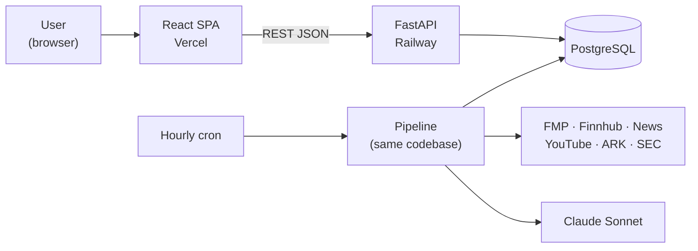

# Perennial — Architecture Brief for the Team

**Date:** 2026-08-03 · **For:** Hong, Cohen, Jaden, Aalind · **From:** Bryan (pipeline + database)
**Read time:** ~15 min. Full detail lives in [`docs/architecture/`](.) — this is the summary plus the tradeoffs.

---

## TL;DR — what changed today

1. **The M5 blocking decisions are answered.** React web app · Python/FastAPI backend · PostgreSQL only · hourly data refresh · Claude Sonnet for explanations · 50–150 curated tickers.
2. **The architecture has one big rule:** the app never waits on a third-party API. A background pipeline builds all content on a schedule; the API just serves what's already in Postgres.
3. **Firestore is retired.** One database, one mental model.
4. **The database schema is designed and sliced into five migrations**, ordered so nobody sits blocked.
5. **Five things still need the team** — one of them is a real vote (see §6). Please read that section before Monday.

---

## 1. The eight questions we'd been stuck on

These were sitting unresolved in `development/TODO.md` and `milestones/milestone-5/TODO.md`. All eight are now answered:

| Question | Answer | Why |
|---|---|---|
| React Native or React? | **React web** | Graders and user testers click a link — no app store, no TestFlight. Our wireframes are 375px mobile-first, so we build responsive and it still looks right on a phone. |
| Node or Python? | **Python** | We already have ~1,500 lines of working Python on Cohen's and Hong's branches. Rewriting it in Node would be throwing away real work. |
| Postgres or Firestore? | **Postgres** | Our data is deeply relational (event → sectors → companies → explanations). Also: our own TODO said "PostgreSQL confirmed" while the only working code shipped to Firestore. That contradiction is now resolved. |
| What scale? | **Demo scale** — under 100 accounts | This one decision kills a lot of complexity we were about to build. |
| How fresh is the data? | **Hourly** | Our notes said both "every N minutes" and "daily at 9am." Free API tiers can't support minutes. Hourly is honest. |
| LLM? | **Claude Sonnet, at ingest time only** | Good quality/price balance. Never called during a user request. |
| How many companies? | **50–150 curated tickers** | Fits free API quotas and keeps scoring tractable. |
| Deadline? | ~5 months, plan by milestone | We sequence by what's demoable, not by dates. |

---

## 2. The architecture in one picture

**The one rule that shapes everything:** a user request touches only Postgres. It never calls FMP, never calls a news API, never calls Claude.

Why this matters: we depend on six external services, all on free tiers, all capable of being down or empty at a bad moment. If any of them sat in the request path, our uptime would be the product of theirs and our page loads would be as slow as their worst day. Instead, the pipeline pulls everything on a schedule and writes it to the database, and the API serves whatever the last run produced.

**The tradeoff:** our data can be up to an hour old, and there's no "refresh now" button. We handle that honestly — every screen carries a `data_as_of` timestamp instead of pretending to be live. For beginner investors checking an app a few times a day, this is the right call. It would be the wrong call for a day-trading tool.

---

## 3. Database decisions that affect your work

Full DDL is in [`pipeline-and-schema-guide.md`](pipeline-and-schema-guide.md). The four that change something you might have assumed:

**Watchlist uses two foreign keys, not `(target_type, target_id)`.** Our schema TODO sketched a polymorphic target. The problem: a polymorphic ID can't have a foreign key, so deleting a company would leave orphaned watchlist rows and users would watch saved items silently vanish. Now it's `company_id` and `sector_id`, with a constraint that exactly one is set. **The API contract doesn't change** — `?filter=companies` still works the same way.

**Daily-uniqueness uses explicit `as_of_date` columns.** Not `captured_at::date`. Casting a timestamp to a date depends on the database session's timezone setting, which makes that kind of index non-deterministic — two rows could land on the same day and not collide.

**Every number has an explanation column next to it, and it's `NOT NULL`.** Impact explanations, bucket explanations, score breakdowns. This is our product promise made structural: if you can't explain it, the database won't store it. It also means **the LLM writes explanations but does not compute the score** — the 0–100 number comes from a deterministic formula in code, so it's testable and reproducible. When someone asks "why 72?", we answer with arithmetic.

**Everything the pipeline writes is an upsert on a natural key.** Running the pipeline twice changes nothing. This sounds like a technicality but it's what lets us skip a whole layer of infrastructure — if re-running is always safe, then "the next hourly run is the retry" is a policy rather than a hope, and we don't need a job queue or retry bookkeeping.

---

## 4. Tradeoffs — what we gave up, honestly

Every decision cost something. Here's the ledger.

| Decision | What we gain | What it costs us |
|---|---|---|
| Pipeline separate from API | App never breaks when a provider does; fast page loads | Data up to an hour stale; no on-demand refresh |
| Postgres only | One store, one backup story | **Cohen has to port the Firestore uploader** — roughly a day of redoing work that already works |
| No Redis, no job queue | Two processes to run instead of five | If we ever need real-time, we add infrastructure later |
| We build our own auth | Hong owns real security work; strong M5 writeup material | **We own the risk.** Hand-rolled auth is where student projects get burned. No password-reset email in v1 (no email service) — resets go through a CLI |
| FastAPI, not Django | Fits our existing code and folder plan exactly | **No free admin UI.** Fixing a bad impact flow means psql or a script, not a web form |
| LLM at ingest only | Nobody waits on Claude; costs stay ~$15–40/month | Content is only as good as the last run; no "explain this differently for me" feature |
| Score is a formula, LLM only explains | Testable, reproducible, auditable | **Cohen has more design work up front** — we need a real weighted formula, not vibes |
| Web app, not native | Zero install friction for testers | No push notifications; no app-store artifact for portfolios |
| 50–150 curated tickers | Fits free API quotas | If a tester searches for their favorite stock and it's missing, that's a bad moment. **We should pick the universe with our testers in mind** |
| No staging environment | Half the ops | We test locally and in production. Mitigated by good seed data |
| No Airflow / Terraform / Spark | Weeks of our semester back | Fewer buzzwords on résumés (see §7 — there's a cheap way to get this back if we want it) |

---

## 5. What we're deliberately NOT building — and how to add it later

Everything on the M4 rejected list stays rejected: screeners, portfolio tracking, weekly digest, learning overlay, market health dashboard, standalone search. Plus these:

| Not building | The seam we left |
|---|---|
| Notification delivery (email/push) | The preferences table and Settings UI ship anyway; the `has_new_event` flag is the trigger a future digest job would read |
| Risk Comfort onboarding step | `user_interests.interest_type` is an open enum — adding it later is one migration and one screen |
| Redis / caching | Read queries live in service functions, so a cache drops in behind the same interface |
| Multi-provider failover | Each data source sits behind a client interface, so a backup provider is a second implementation, not a refactor |
| An orchestration tool (Prefect/Dagster) | Pipeline stages already have the exact shape those tools want — adopting one later is a decorator, not a rewrite |

---

## 6. ⚠️ Decisions that need the team

**Please come to Monday with an opinion on these.**

### 6.1 THE VOTE: what do our two buckets actually mean?

This is the one genuine contradiction in our repo, and it matters because these are the words our whole product is built on.

| | Our services TODO says | Hong's working pipeline says |
|---|---|---|
| **Affordable & Growing** | lower price + positive momentum | companies held by ARK ETFs |
| **Popular & Stable** | high market cap + steady momentum | Congress purchases confirmed by insider buying |

These produce **different company lists and different explanations.** We can't ship both.

**Proposal:** membership comes from transparent screening criteria (price, market cap, momentum), and the Congress/ARK/insider signals become *inputs to the Confidence Score* instead — showing up as reasons like "members of Congress bought this recently" and "insiders are buying."

**Reasoning:** our design principle is beginner-verifiable plain language. "This is under $50 and growing" is a sentence a user can check. "A fund we track holds it" isn't. Also, Hong's own `insider.py` describes itself as "a SCORER not a gate" — so this is closer to what that code already intends than it might look.

**Nothing is wasted either way** — Hong's fetchers get used regardless, just at a different layer.

### 6.2 Four smaller confirmations

- **MVP scope:** confirm the P0/P1/P2 cut in our root `TODO.md` is what we're building.
- **Risk Comfort:** it's in the M4 writeup but not in the IA. Proposal is **out** (the IA is our locked source of truth). Confirm or overturn.
- **News provider:** NewsAPI or GNews. Someone should read both free-tier licenses before we commit. Note NewsAPI's free tier is development-use-only, which may matter for a public demo.
- **YouTube scraping:** transcript collection via yt-dlp is a gray area under YouTube's terms. It's defensible for a non-commercial academic project, but we should agree to it as a team rather than drift into it. If anyone's uncomfortable, Reddit's official API is the swap.

---

## 7. "Shouldn't we be using Airflow / Terraform / Spark?"

Expect this question, so here's the short answer for each:

- **Spark** processes data too big for one machine. Our entire dataset fits in a laptop's RAM many times over. Using it would be slower and would signal we'd misread the problem.
- **Terraform** manages infrastructure at scale. We have four resources and one environment. What we *should* do instead — and are — is commit our Docker Compose file and service config so the setup is reproducible and shows up in the M5 writeup.
- **Airflow** is the closest call, since our pipeline genuinely is a DAG. But it needs a scheduler, a webserver, an executor, and its own database — four processes to orchestrate nine tasks that run once an hour. The orchestrator would be bigger than the app.

**If we want orchestration experience on our résumés**, the right move is Prefect or Dagster in month three, not Airflow now. Both are pip-installable, run as a single process, and our stage design already fits them. And frankly: "I built idempotent pipeline stages with budget-aware API clients and a run ledger" is a better interview answer than "I configured Airflow," because the first shows you know what an orchestrator does.

---

## 8. What each of us is unblocked to do

*(Suggested split based on our charter roles — let's confirm ownership Monday, since Bryan has picked up the pipeline and database track.)*

| Who | Next up | Blocked on |
|---|---|---|
| **Bryan** | Alembic setup, migration slice 1, then the news → event → impact-flow pipeline stages | Nothing — starting now |
| **Hong** | Auth service (argon2 + JWT with rotating refresh tokens), `AUTH_FLOW.md`; later the privacy export/delete endpoints | `users` + `refresh_tokens` tables — **shipping in slice 1 specifically so you're not waiting** |
| **Cohen** | The scoring formula (`SCORING_FORMULA.md`), prompt design for event summaries and impact flows, plus porting the YouTube pipeline off Firestore | Slice 2 for score storage; prompt work can start immediately |
| **Jaden** | `EventImpactFlow` component first (hardest + our differentiator), then Homepage and Company Detail | API types are auto-generated from the backend, so the contract is enforced by CI rather than by us remembering to sync |
| **Aalind** | API service: routers, middleware stack, response shapes | Slice 1 tables |

---

## 9. Where everything lives

| Doc | What's in it |
|---|---|
| [`overview.md`](overview.md) | Components, trust boundaries, deployment, cross-cutting concerns |
| [`data-flows.md`](data-flows.md) | Six user/system workflows with failure handling; data lifecycle and PII |
| [`stack-decision.md`](stack-decision.md) | Three candidate stacks compared, with the case against our own pick |
| [`build-plan.md`](build-plan.md) | Walking skeleton, seven milestones, ranked risks |
| [`pipeline-and-schema-guide.md`](pipeline-and-schema-guide.md) | Full DDL, indexes, the five real queries, pipeline stage contract, quality gates |
| [`decisions/ADR-001…010`](decisions/) | One file per decision: context, options, decision, consequences |

Every decision has an ADR, so when we write the M5 implementation report, the "architecture, decisions, tradeoffs" section is assembled from files we already wrote instead of reconstructed from memory.
